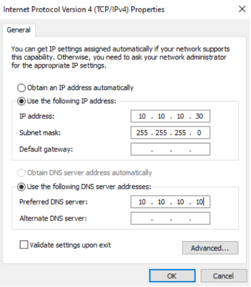
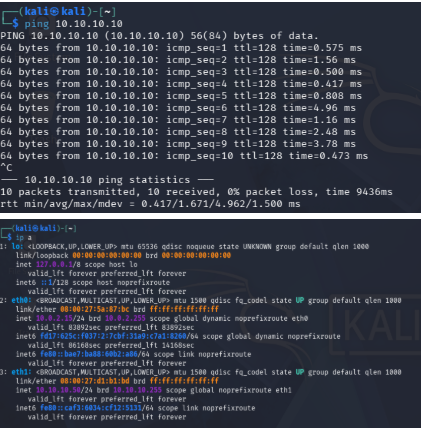

# Environment Setup

This is the infrastructure behind the lab: what I built, in what order, and why each piece exists. If you just want to see an attack, skip ahead to one of the attack write-ups, this doc is the "how the lab was built" reference.

## What I built

| Machine | Purpose |
|---|---|
| **DC01** | The Domain Controller. Runs Active Directory, so it manages all the user accounts and handles logins for the whole lab. |
| **SIEM01** | Runs Splunk. This is where all the logs end up, so I can search them in one place instead of digging through Event Viewer on every machine. |
| **CLIENT01** | A normal Windows 11 workstation, joined to the domain. This represents an everyday employee's computer, the kind of machine an attacker usually lands on first. |
| **Kali** | My attacker machine, running the actual attack tools. |

All four machines are VirtualBox VMs connected to each other through an **internal network** called `labnet`, which is isolated from my real home network. Each VM also has a second, separate network adapter (NAT) just for internet access during setup, like downloading Windows updates, that adapter has nothing to do with the lab itself.

## 1. Building the Domain Controller (DC01)

**What a Domain Controller does:** think of it as the "manager" for every computer and user account in a company network. Instead of each computer checking its own local list of passwords, they all ask the Domain Controller, "is this login correct?" This is what makes centralized attacks (and centralized detection) possible.

**Steps:**
1. Installed Windows Server 2022 (Desktop Experience) in VirtualBox.
2. Promoted it to a Domain Controller, creating a brand new domain called `lab.local`.
3. Gave it a fixed IP address, `10.10.10.10`, on the `labnet` network. A Domain Controller needs a fixed address so every other machine can reliably find it, and it points to itself for DNS, since it's also the one answering "what's the address for X" questions on this network.


### Creating test user accounts

I created an Organizational Unit (basically a folder inside Active Directory) called `LabUsers`, and added a few test accounts with realistic but weak passwords, these are the "employees" my attacks will target later.


### Creating a service account for Kerberoasting

I also created an account called `svc_sql`, meant to represent a service (like a database) rather than a real person. I gave it something called an **SPN (Service Principal Name)**, which tells Active Directory "this account provides a network service." This is what makes an account a valid target for a Kerberoasting attack later, any logged-in user can ask for a ticket tied to this account, and if its password is weak, that ticket can be cracked offline.

```
setspn -A MSSQLSvc/dc01.lab.local:1443 svc_sql
```


### Turning on audit logging

By default, Windows Server barely logs anything useful. I had to explicitly turn on three audit settings through Group Policy:

- **Audit Credential Validation** — logs every time a username/password is checked (this is what catches password spraying)
- **Audit Kerberos Service Ticket Operations** — logs every Kerberos ticket request (this is what catches Kerberoasting)
- **Audit Logon** — logs successful and failed interactive logons

Without these three turned on, none of the attacks later in this project would show up in the logs at all, the events simply wouldn't be recorded.


## 2. Building the SIEM (SIEM01)

**What a SIEM does:** it's a central place to collect, search, and alert on logs from every machine in the network, instead of checking each computer's Event Viewer one at a time. I used **Splunk Enterprise** (the free trial).

**Steps:**
1. Built a second Windows Server 2022 VM, fixed IP `10.10.10.20`.
2. Installed Splunk Enterprise and confirmed I could log into its web interface.
3. Turned on a **receiving port** (9997) in Splunk's settings, so it would accept logs being sent to it from other machines.


### Connecting DC01 to Splunk

Having a SIEM is useless unless something actually sends it logs. I installed the **Splunk Universal Forwarder** on DC01, a small lightweight program whose only job is to collect specific logs and ship them to SIEM01.

I told it which logs to forward by creating a config file (`inputs.conf`):
```
[WinEventLog://Security]
disabled = false

[WinEventLog://System]
disabled = false
```


### Confirming it actually worked

I searched in Splunk for anything coming from DC01, and saw real Windows events arriving with correct timestamps, proof the whole pipeline (DC01 → Forwarder → SIEM01 → Splunk search) was working end to end.


## 3. Building the client (CLIENT01)

This represents a normal employee machine, the kind of computer attackers usually compromise first before moving toward the Domain Controller.

1. Installed Windows 11 as its own VM, fixed IP `10.10.10.30`, DNS pointed at DC01.
2. Joined it to the `lab.local` domain (System Properties → Change → Domain).
3. Logged in as one of the test domain users to confirm the join worked.



## 4. Connecting Kali

Kali needed its own address on `labnet` so it could actually reach the other machines.

```
sudo ip addr add 10.10.10.50/24 dev eth1
sudo ip link set eth1 up
```

Then confirmed it could reach DC01:
```
ping 10.10.10.10
```



**Note:** this IP resets every time Kali restarts, since it wasn't saved permanently. I just re-run this command at the start of each session.

## Problems I ran into (and what they taught me)

I kept these in because they were genuinely useful lessons, not just "everything worked perfectly."

**Splunk's own service stopped unexpectedly, more than once.**
Running `splunk status` showed `Splunkd: Stopped`. Fixed each time with `splunk start`, but it taught me to always check Splunk is actually alive before assuming a missing search result means "no attack happened", it might just mean the SIEM wasn't collecting anything at that moment.

**The forwarder on DC01 showed "Configured but inactive."**
```
splunk list forward-server
→ Configured but inactive forwards: 10.10.10.20:9997
```
This meant DC01 knew where to send logs, but the connection wasn't actually working. I diagnosed it with `Test-NetConnection -ComputerName 10.10.10.20 -Port 9997` in PowerShell, which confirmed the port was unreachable. The real cause was Windows Firewall blocking the connection, fixed by adding an explicit allow rule for port 9997 on SIEM01.


**VM clocks drifted out of sync.**
At one point Kali's clock was 3 hours ahead of DC01's. This caused real confusion when searching Splunk, I was searching for "recent" events based on Kali's clock, while Splunk was timestamping everything using DC01's (different) clock. Lesson: always check the actual event timestamps in Splunk rather than assuming "it just happened" lines up with "recent" in a search.

**Low RAM and a slow USB drive.**
My host machine only has 12 GB of RAM, and my VMs are stored on an external USB drive. Running three Windows VMs at once made everything crawl. I worked around this by lowering each VM's memory allocation (DC01 to 1.5–2 GB, SIEM01 to 2 GB) and being deliberate about which VMs needed to run together for a given task.

## What's next

With all four machines built and talking to each other, the lab is ready for attacks. See the write-ups linked from the main [README](../README.md).
