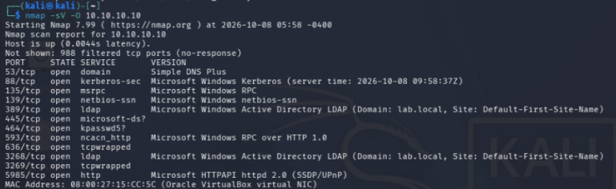
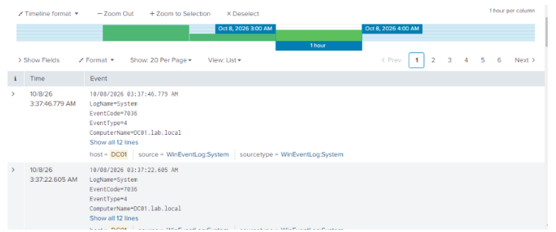

# Nmap Scan — Attack & Detection

**Attack #1 of 5** · [Back to overview](README.md)

## What this attack is

Before attacking anything, a real attacker first needs to figure out what's actually there: what machines exist, what services they're running, and what version of Windows they're on. This step is called **reconnaissance**, and **Nmap** is the standard tool for it. It's not an attack by itself, no passwords are guessed, nothing is broken into, but it's almost always the very first step, since it tells the attacker what to target next.

## How I ran it

From Kali, I scanned DC01 directly:

```
nmap -sV -O 10.10.10.10
```

- **`-sV`** asks Nmap to identify what software is actually running behind each open port (not just "port 445 is open", but "port 445 is running Microsoft SMB")
- **`-O`** asks Nmap to guess the operating system

### Result

```
PORT     STATE SERVICE      VERSION
53/tcp   open  domain       Simple DNS Plus
88/tcp   open  kerberos-sec Microsoft Windows Kerberos (server time: 2026-10-08 09:58:37Z)
135/tcp  open  msrpc        Microsoft Windows RPC
139/tcp  open  netbios-ssn  Microsoft Windows netbios-ssn
389/tcp  open  ldap         Microsoft Windows Active Directory LDAP (Domain: lab.local, Site: Default-First-Site-Name)
445/tcp  open  microsoft-ds?
464/tcp  open  kpasswd5?
593/tcp  open  ncacn_http   Microsoft Windows RPC over HTTP 1.0
636/tcp  open  tcpwrapped
3268/tcp open  ldap         Microsoft Windows Active Directory LDAP (Domain: lab.local, Site: Default-First-Site-Name)
3269/tcp open  tcpwrapped
5985/tcp open  http         Microsoft HTTPAPI httpd 2.0 (SSDP/UPnP)
```



## Why this result matter

This single scan tells an attacker almost everything they need to know to plan their next move, without needing any credentials at all:

| Port(s) | What it reveals |
|---|---|
| 53 | DC01 is also the DNS server for this network |
| 88 | This machine handles Kerberos authentication, confirming it's a Domain Controller. It also leaked the **server's exact time**, real attackers use this to sync their clock, since Kerberos attacks are picky about timing |
| 135, 593 | Windows RPC, used for remote management |
| 139, 445 | SMB/NetBIOS, file sharing, and one of the most commonly attacked Windows services |
| 389, 636, 3268, 3269 | LDAP and Global Catalog ports, these **confirm** this is a Domain Controller for the domain `lab.local`, and even reveal the site name |
| 464 | Kerberos password-change service |
| 5985 | Likely WinRM, used for remote administration, also a common target for later lateral movement |

In short: this one scan told me "this is a Domain Controller, here's its domain name, and here's where to attack next (Kerberos, SMB)." That's exactly why reconnaissance matters, and why DCs are usually the most carefully watched machines on a real network.

## Checking the detection side

I searched Splunk for anything DC01 logged around the time of the scan:

```
index=main host=DC01 earliest="10/08/2026:00:00:00" latest="10/08/2026:06:00:00"
```



**Result: nothing related to the scan showed up.** The only events in that window were routine background noise (Windows services starting and stopping), completely unrelated to the scan.

## My finding (this is the important part)

This isn't a mistake, it's a real and useful result. **A basic Nmap scan leaves no trace in the Windows Security log**, because the audit settings I enabled (Credential Validation, Kerberos Ticket Operations, Logon) only record events tied to an actual logon or authentication attempt. Nmap's `-sV`/`-O` scan never tries to log in, it just asks "what's listening on this port," so there's nothing for those specific audit categories to catch.

**What it would take to actually detect this:**
- **Windows Filtering Platform (WFP) auditing**, a separate audit category that logs individual network connections, which would be noisy but could reveal scan-like patterns (many ports touched in a few seconds, from one source)
- **Network-level monitoring**, like Zeek or a firewall log, sitting outside the Windows host entirely, watching traffic rather than waiting for Windows to decide something is log-worthy

This is a genuinely common gap in real environments too: host-based logging (like what I set up here) is often blind to pure reconnaissance. It usually takes network visibility to catch a scan before it turns into an actual attack.

## Takeaways

- Reconnaissance happens before any credentials are involved, so it's invisible to logon-based auditing
- A DC's open ports alone reveal the domain name, site name, and attack surface, this is why it's considered best practice to restrict who can even reach a Domain Controller's ports in the first place
- Detecting scans requires different tooling (network monitoring) than detecting credential-based attacks (host auditing), they're not interchangeable

---
**Next:** [Password Spraying — Attack & Detection](03-password-spraying.md)
