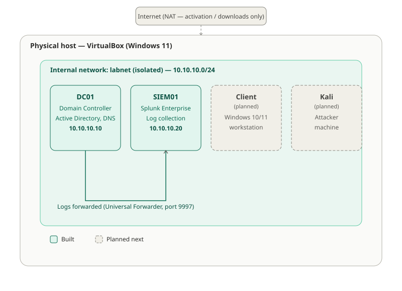

# Active Directory Attack & Detection Lab

A home lab where I built a small Active Directory network, attacked it myself using real tools, and then found what each attack looked like in Splunk. The goal is to show both sides: how an attack works, and how to spot it in the logs.

I have a penetration testing background, so this project is my way of learning the defensive (blue team) side using the same attacks I already know how to run.

## Why this project

Most beginner SIEM projects use ready-made sample logs. This one doesn't. Every log in here was generated by an attack I actually ran, against a lab I built myself. That means the logs are messy and real, including the mistakes and dead ends, which I've kept in the write-ups on purpose.

## Lab layout

| Machine | Role | IP |
|---|---|---|
| DC01 | Domain Controller (Windows Server 2022) | 10.10.10.10 |
| SIEM01 | Splunk Enterprise (log collection) | 10.10.10.20 |
| CLIENT01 | Domain-joined Windows 11 workstation | 10.10.10.30 |
| Kali | Attacker machine | 10.10.10.50 |

All four run as VirtualBox VMs on one isolated internal network (`labnet`), with no connection to my home network.

## Read the write-ups in this order

1. **[Environment Setup](01-environment-setup.md)** — building the Domain Controller, the SIEM, the client, and connecting everything together
2. **[Nmap Scan — Attack & Detection](02-nmap-scan.md)** — basic reconnaissance, and what it does (and doesn't) leave behind in the logs
3. **[Password Spraying — Attack & Detection](03-password-spraying.md)** — guessing weak passwords across multiple accounts, and catching it in Splunk

More write-ups (Kerberoasting, brute force, lateral movement) are coming as I finish them.

## Tools used

`VirtualBox` `Windows Server 2022` `Windows 11` `Active Directory Domain Services` `Group Policy (Advanced Audit Policy)` `Splunk Enterprise` `Splunk Universal Forwarder` `Kali Linux` `nmap` `netexec`

## About me

Fresh graduate in Network & Security with hands-on penetration testing experience. Building this project to develop detection engineering and blue team skills alongside my offensive background.
