# Active Directory Attack & Detection Lab

A hands-on home lab where I built an Active Directory environment, simulated real attacks against it, and built detections for them using Splunk. The project combines offensive techniques (from my penetration testing background) with defensive detection engineering, mapped to MITRE ATT&CK.

**Status:** 🚧 In progress — environment setup complete, attack simulations and detections coming next.

## Why this project

As a fresh graduate with a penetration testing background, I wanted a project that connected offense and defense rather than just one side. Most beginner SOC/SIEM projects use pre-made sample logs. This lab generates its own: I attack an environment I built myself, then investigate what each attack looks like in the logs, and write detections for it.

## Lab Architecture

| Machine | Role | OS | IP |
|---|---|---|---|
| DC01 | Domain Controller | Windows Server 2022 | 10.10.10.10 |
| SIEM01 | Log collection & analysis | Windows Server 2022 + Splunk Enterprise | 10.10.10.20 |
| Client (planned) | Attack target / workstation | Windows 10/11 | TBD |
| Kali | Attacker machine | Kali Linux | TBD |

All machines run as VirtualBox VMs on an isolated internal network (`labnet`), separate from any production or home network, with no internet access except where needed for activation/downloads.

**Domain:** `lab.local`

## What's been built so far

### 1. Domain Controller setup
- Installed Windows Server 2022 (Desktop Experience) in VirtualBox
- Promoted to a Domain Controller for a new forest, `lab.local`
- Created an Organizational Unit (`LabUsers`) with several test user accounts using realistic, intentionally weak passwords, to serve as targets for password spraying and brute-force attacks
- Created a service account (`svc_sql`) with a Service Principal Name (SPN) assigned via `setspn`, to serve as a Kerberoasting target
- Configured static IPs on the internal lab network (`labnet`) for both DC01 (`10.10.10.10`) and SIEM01 (`10.10.10.20`), with SIEM01 pointed at DC01 for DNS

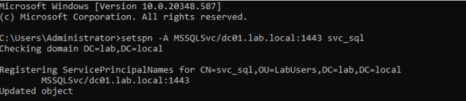
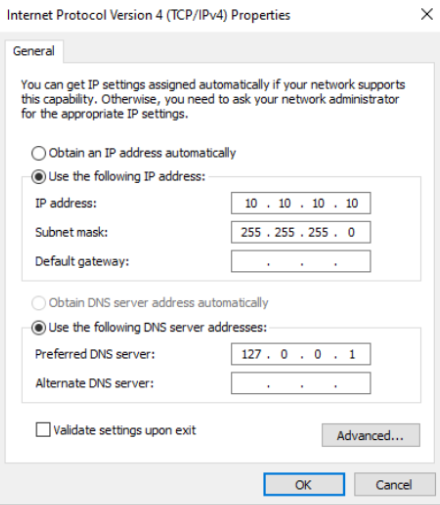
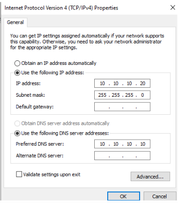
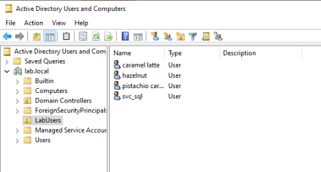

### 2. Audit logging
Configured the Default Domain Controllers Policy with Advanced Audit Policy settings, since Windows Server logs very little by default:
- **Account Logon → Audit Credential Validation** (Success & Failure)
- **Account Logon → Audit Kerberos Service Ticket Operations** (Success & Failure)
- **Logon/Logoff → Audit Logon** (Success & Failure)

These generate the event IDs the project relies on later, including:
- `4624` / `4625` — successful / failed logon
- `4769` — Kerberos service ticket request (key for detecting Kerberoasting)

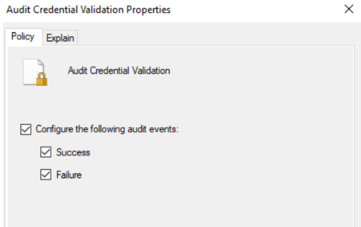
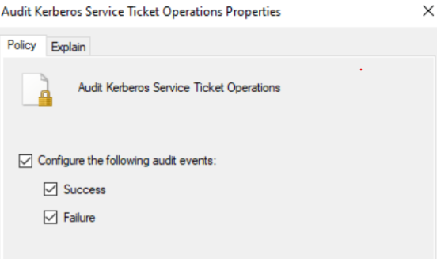

### 3. SIEM setup
- Deployed a second VM (SIEM01) running **Splunk Enterprise** (free trial)
- Configured a receiving port (`9997`) to accept forwarded logs
- Installed the **Splunk Universal Forwarder** on DC01, configured via `inputs.conf` to forward the Windows `Security` and `System` event logs

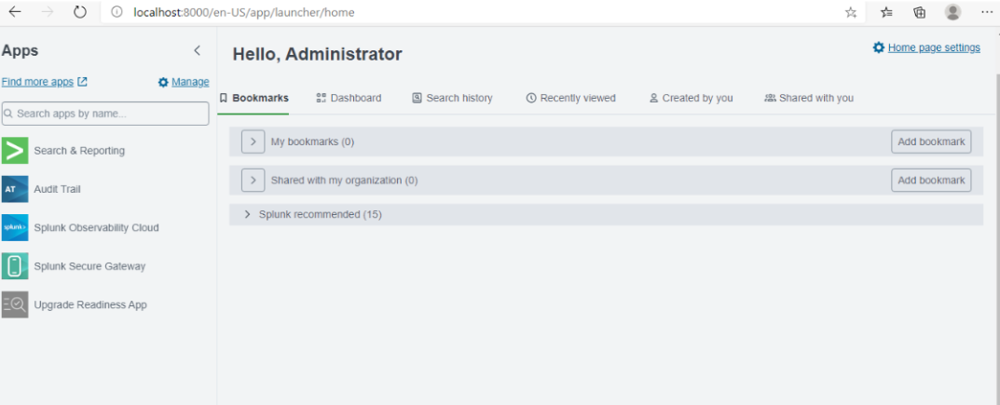
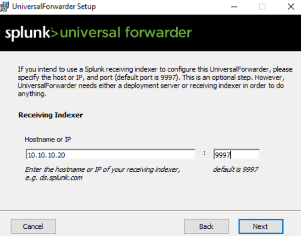

### 4. Verified log pipeline
Confirmed logs are flowing end-to-end from DC01 into Splunk:
- `WinEventLog:System` events (e.g. service start/stop, EventCode 7036) appearing in Splunk with correct host and timestamp
- `WinEventLog:Security` events, including **EventCode 4769** (Kerberos service ticket requests), confirming the audit policy is correctly generating the events this project needs

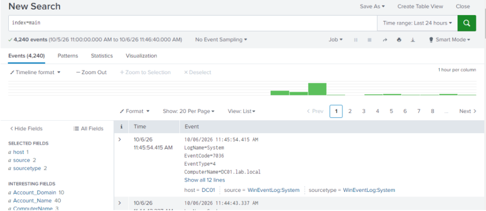
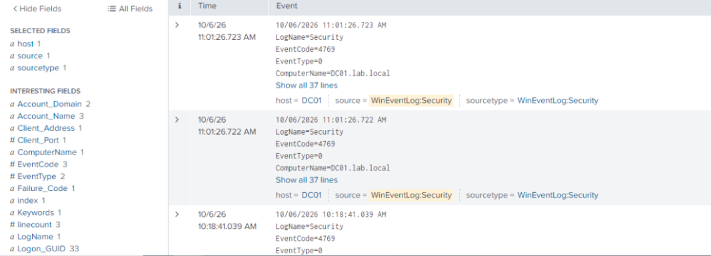

## Troubleshooting notes

A few real issues I hit and resolved, documented here since they're common pitfalls:

- **`splunk list forward-server` showed "Configured but inactive forwards."** Diagnosed with `Test-NetConnection` on the forwarding host, which showed the port was unreachable. Fixed by confirming the receiving port was configured in Splunk and opening port 9997 through Windows Firewall on the SIEM host. Re-checking afterward confirmed the forward moved from inactive to active.

  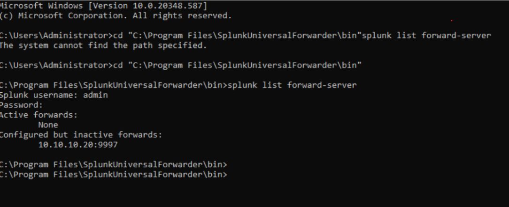
  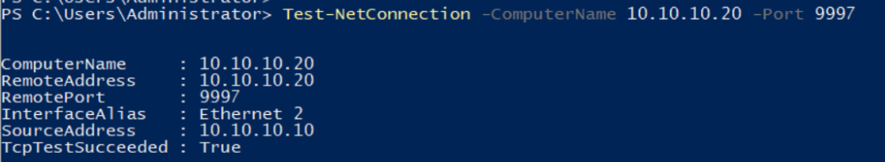

- **SplunkForwarder service failed to start (Error 1053).** Caused by trying to start the forwarder before the SIEM VM (its target) was powered on. Resolved by always starting the SIEM VM first.
- **Limited disk/RAM on the host machine** required tuning VM memory allocations down and being deliberate about which drive each VM's disk lived on.

## Tools & technologies

`VirtualBox` `Windows Server 2022` `Active Directory Domain Services` `Group Policy (Advanced Audit Policy)` `Splunk Enterprise` `Splunk Universal Forwarder` `Kerberos / SPNs`

## Next steps

- [ ] Build a Windows 10/11 client and join it to the domain
- [ ] Connect Kali Linux to the lab network
- [ ] Simulate attacks: password spraying, brute force, Kerberoasting, lateral movement
- [ ] Identify each attack's footprint in Splunk and build saved searches / alerts
- [ ] Map each detection to MITRE ATT&CK techniques
- [ ] Add a basic Windows forensics pass on the client after an attack
- [ ] Publish full write-ups per attack with queries and screenshots

## About me

Fresh graduate in Network & Security with hands-on penetration testing experience, building this project to develop detection engineering and blue team skills alongside my offensive background.
